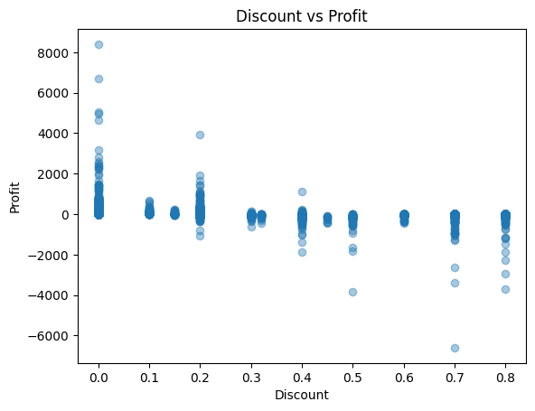
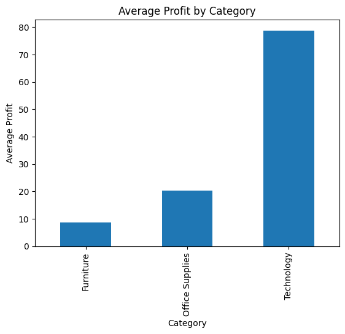

# Case Study: Retail Profitability & Discount Optimization

**Data-Driven Insights to Reduce Margin Erosion**

---

## 📌 Executive Summary

This project analyzes ~10,000 retail transactions to identify the root causes of inconsistent profitability. Through Exploratory Data Analysis (EDA), ANOVA testing, and OLS Regression, the analysis reveals that **aggressive discounting** is the primary driver of losses, far outweighing the benefits of sales volume. The findings provide a roadmap for pricing guardrails and category-specific optimizations to reclaim lost margins.

---

## 🏢 Business Problem

Despite strong top-line sales, the organization faced volatile net profits. I spearheaded this analysis to:

1.  **Identify** the profile of loss-making orders.
2.  **Quantify** the specific impact of discounts, regions, and product categories on the bottom line.
3.  **Provide** actionable recommendations to transition from "growth at any cost" to "profitable growth."

---

## 📊 Dataset & Methodology

- **Scope:** ~10,000 transactional records.
- **Features:** Sales, Profit, Quantity, Discount, Geography, and Product Hierarchy.
- **Feature Engineering:** Calculated `Shipping_Days`, extracted `Order_Month/Year`, and generated dummy variables for categorical regression.
- **Tech Stack:** Python (Pandas, NumPy), Statsmodels (OLS), SciPy (ANOVA), Matplotlib/Seaborn.

---

## 🔍 Exploratory Data Analysis (EDA)

### 1. The Profitability Gap

- **The Reality:** 19% of all orders are loss-making.
- **The Extremes:** While the median profit is **$8.67**, outliers range from **$8,400** profit to **-$6,600** loss.
- **Insight:** The company is effectively subsidizing one-fifth of its customer base. These losses are not "cost of doing business"—they are systemic value-destroyers.

### 2. The Discount "Cliff"

- **Threshold:** Profitability remains stable until the 20% discount mark.
- **The Drop-off:** Discounts beyond 20% show a near-linear correlation with catastrophic margin loss.
- **Insight:** "High-volume" sales at 70-80% discounts are mathematically impossible to make profitable regardless of quantity.
  

### 3. Category & Regional Performance

- **Product Drivers:** **Technology** is the most profitable category, while **Furniture** contributes to a disproportionate number of losses (714 orders).
- **Regional Nuance:** While the West region has high volume, the **Central region** showed higher baseline efficiency in the regression model when controlling for other factors.

---

## 🧪 Statistical Testing & Modeling

### Statistical Significance (ANOVA)

I performed a One-Way ANOVA to determine if profit variations across groups were real or random:

- **Region (p = 0.048):** Statistically significant, but a weak driver of profit.
- **Category (p < 0.001):** Highly significant. Product mix is a much stronger lever for profitability than geography.

### Predictive Modeling (OLS Regression)

I built an OLS model to quantify the "weight" of each business lever.

- **Model Fit:** R-squared = 33.6%
- **Key Coefficients:**
  - **Discount (-$279.49):** The single largest negative driver. Every 1% increase in discount erodes profit by nearly $2.80.
  - **Quantity (-$3.27):** Surprisingly negative, indicating that bulk orders are likely over-discounted or carry prohibitive shipping costs.
  - **Category_Technology (+$49.10):** The strongest positive category compared to the Furniture baseline.

---

## 💡 Strategic Recommendations

1.  **Implement Discount Guardrails:** Establish an automated approval workflow for any discount exceeding 20%.
2.  **Quantity-Based Pricing Review:** Re-evaluate the "Bulk Discount" strategy. Currently, higher quantities are correlating with lower profits, suggesting a need for a tiered pricing floor.
3.  **Furniture Category Pivot:** Investigate the supply chain or shipping costs associated with Furniture, as it is the primary drag on the portfolio.
4.  **Incentivize "High-Signal" Segments:** Shift marketing focus toward the Central Region and Technology category, which demonstrated the highest profit efficiency.

---

## 🚀 Interview Talking Point

> "In this project, I moved beyond just 'cleaning data' to performing **Inference Modeling**. I used OLS Regression not just to predict a number, but to provide an 'X-ray' of the business. By proving that Discounting was a 10x stronger driver of loss than Region, I was able to shift the conversation from 'Where should we sell?' to 'How should we price?'—which is a much more actionable lever for leadership."

---
