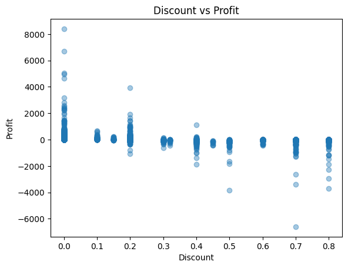
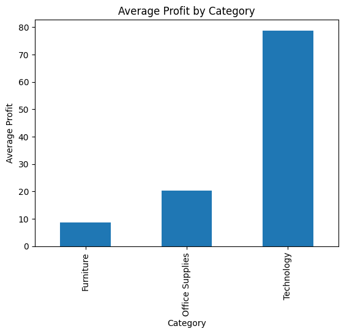
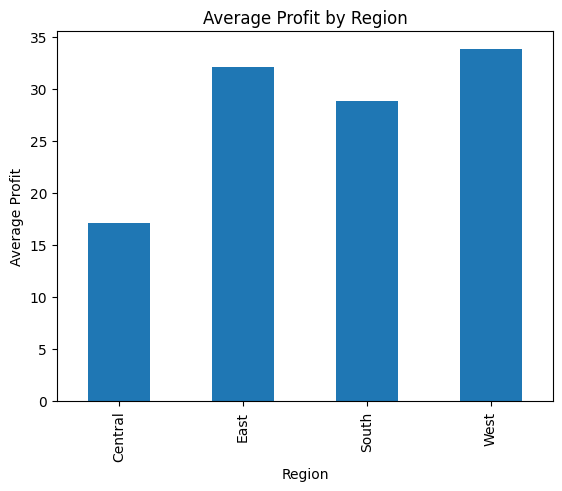

# Retail Profitability & Discount Optimization  
### Data-Driven Strategy to Reduce Margin Erosion

## Executive Summary
Why are companies losing money despite strong sales?

This project analyzes ~10,000 retail transactions and identifies a key issue: aggressive discounting is systematically reducing profitability.

- 19% of all orders are loss-making  
- Profit declines sharply beyond a 20% discount threshold  
- Discounting is the largest negative driver of profit  

Using statistical analysis and regression modeling, this project provides actionable recommendations to shift from “growth at any cost” to “profitable growth.”

---

## Business Problem
Despite strong revenue, the business experienced inconsistent and volatile profitability.

Key objectives:
- Identify the characteristics of loss-making transactions  
- Quantify the impact of discounts, product categories, and regions on profit  
- Recommend strategies to improve margins  

---

## Dataset
- ~10,000 transactional records  
- Features include:
  - Sales, Profit, Quantity, Discount  
  - Product category and sub-category  
  - Region and order date  

---

## Methodology

### Exploratory Data Analysis (EDA)
- Profit distribution and outlier detection  
- Discount vs profit relationship  
- Category and regional performance analysis  

### Statistical Testing
- One-Way ANOVA used to test whether differences in profit across groups are statistically significant  

### Predictive Modeling
- Ordinary Least Squares (OLS) Regression  
- Feature engineering:
  - Shipping duration  
  - Time-based features (month/year)  
  - Categorical encoding (dummy variables)  

---

## Key Insights

### Profitability Gap
- 19% of transactions are unprofitable  
- Median profit: $8.67  
- Extreme losses reach up to -$6,600  

The business is effectively subsidizing a significant portion of its transactions.

---

### Discount Threshold Effect
- Profit remains stable until approximately a 20% discount  
- Beyond this point, profit declines rapidly  
- High discounts (70–80%) result in severe losses  

Higher sales volume does not translate to profitability when discounting is excessive.

---

### Category and Regional Performance
- Technology is the most profitable category  
- Furniture contributes disproportionately to losses  
- Category has a stronger impact on profitability than region  

---

### Regression Model Findings
- R-squared: 33.6%  

Key coefficients:
- Discount: -$279.49 (strongest negative driver)  
- Quantity: -$3.27 (bulk orders reduce profit)  
- Technology category: +$49.10 (strongest positive contributor)  

These results indicate that pricing strategy has a greater impact on profitability than sales volume.

---

## Model Considerations
- The model explains approximately 34% of profit variability  
- Results should be interpreted as directional rather than predictive  
- Additional factors not captured may include:
  - Shipping cost variability  
  - Customer segmentation  
  - Operational inefficiencies  

---

## Business Recommendations

### Discount Control
Implement discount limits at or below 20% and require approvals for higher discounts.

### Bulk Pricing Review
Reassess bulk discount strategies and introduce pricing floors to prevent margin loss.

### Category Optimization
Investigate cost structures in the Furniture category, particularly shipping and supply chain inefficiencies.

### Strategic Focus
Prioritize high-performing segments such as the Technology category and Central region.

---

## Business Impact
Reducing excessive discounting has the potential to significantly lower the proportion of loss-making transactions and improve overall margin stability.

---

## Visualizations
Include key charts such as:
- Discount vs Profit  
  

- Profit by category  

- Profit by region  

---

## Tech Stack
- Python (Pandas, NumPy)  
- Matplotlib, Seaborn  
- SciPy (ANOVA)  
- Statsmodels (OLS Regression)  

---

## Key Takeaway
Profitability is not driven by sales volume alone, but by disciplined pricing strategy. Uncontrolled discounting can significantly erode margins, even in high-growth environments.

---

## Author
Avas Bajracharya  
Data Analytics | Software Engineer | Turning data into insights